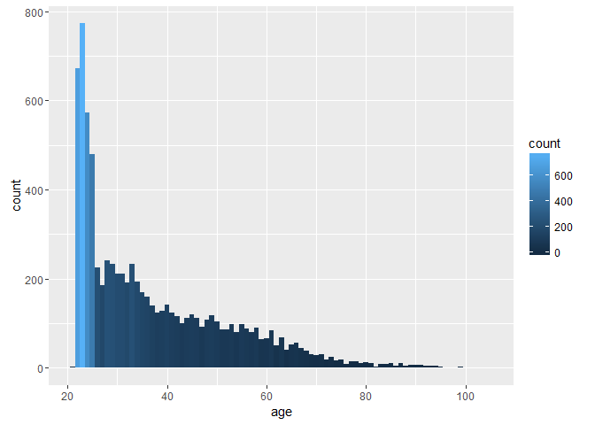
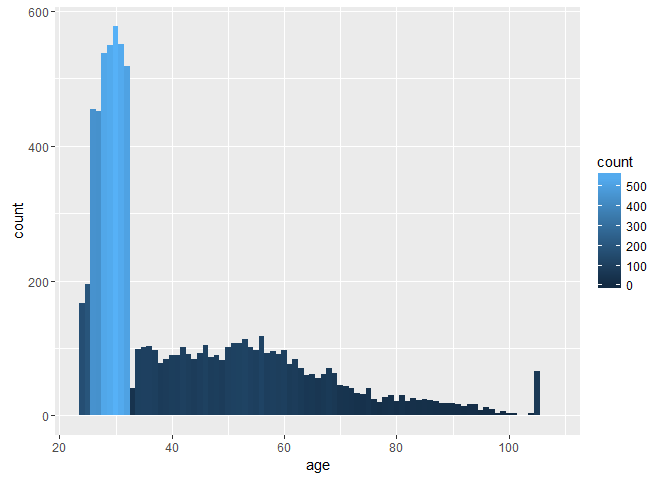

# Homework 8, Live Assignment
Mike Martos  
July 4, 2016  


```r
library(ggplot2)
```

###Download data and prepare

```r
##################################################################################
#This is the raw data, we have it in a zip file in the data folder
#voterdata <- read.csv("./Data/LWV_Data.csv")
#write.table(voterdata, "./Data/FinalData.csv")
##################################################################################
voterdata <- read.csv("./Data/FinalData.csv")
##################################################################################
nvote <- voterdata[which(voterdata$control == 1 | voterdata$flyer == 1 | voterdata$post == 1),]
write.table(nvote, "./Data/FinalData.csv", sep = ",")
##################################################################################
#Calculate age
voterdata$age <- 2016 - voterdata$byear

#Subset the 24K observations 
nvote <- voterdata[which(voterdata$control == 1 | voterdata$flyer == 1 | voterdata$post == 1),]

#Further subset by type of treatment group
fvote <- voterdata[which(voterdata$flyer == 1),]
pvote <- voterdata[which(voterdata$post == 1),]
cvote <- voterdata[which(voterdata$control == 1),]

#New field holding type of treatment
nvote$group <- ifelse(nvote$flyer == 1,"flyer",ifelse(nvote$post == 1,"postcard","control"))

#Change data types for some fields
nvote$byear <- as.factor(nvote$byear)
nvote$flyer <- as.factor(nvote$flyer)
nvote$control <- as.factor(nvote$control)
nvote$post <- as.factor(nvote$post)
```

###Compare birth year and treatment, showing just the most recent years

```r
#Using tail to just show the last records
tail(table(nvote$byear,nvote$post))
```

```
##       
##           0   1
##   1991  708 195
##   1992  782 167
##   1993 1014   0
##   1994 1039   0
##   1995  928   0
##   1996  531   0
```

```r
tail(table(nvote$byear,nvote$flyer))
```

```
##       
##          0   1
##   1991 423 480
##   1992 376 573
##   1993 241 773
##   1994 366 673
##   1995 925   3
##   1996 531   0
```

```r
tail(table(nvote$byear,nvote$control))
```

```
##       
##          0   1
##   1991 675 228
##   1992 740 209
##   1993 773 241
##   1994 673 366
##   1995   3 925
##   1996   0 531
```

####There seems to be some inconsistencies in the later years, on the treatment applied (bias)

###Flyer histogram, right skewed, voters between ~21 AND ~25 were mainly targeted with this treatment

```r
q <- ggplot(fvote, aes(age, fill=..count..))
q + geom_histogram(binwidth=1) 
```

<!-- -->

###Postcard histogram, notice the high concentration in the 25 to 31 age range.

```r
q <- ggplot(pvote, aes(age, fill=..count..))
q + geom_histogram(binwidth=1) 
```

<!-- -->

###High concentration on the 21 age range, compared to the rest of the distribution, one more thing, and probably the most important, is that the data get all the way to 20 years of age, the minimum value is different

```r
q <- ggplot(cvote, aes(age, fill=..count..))
q + geom_histogram(binwidth=1) 
```

<!-- -->

####Showing the three groups together to show some pattern.

###The graph, shows that the postcards, were sent to older people mainly, and the control group has younger people it would seem, or at least has the minimum age observations.

```r
q <- ggplot(nvote, aes(age, fill=group))
q + geom_histogram(binwidth=1) 
```

<!-- -->

####I'll try to run some statistics to prove the above
###Compare mean ages between flyer and postcard treatment groups, it shows strong evidence that the mean age is between 5 and 6 years higher on the postcard group.

```r
t.test(fvote$age,pvote$age)
```

```
## 
## 	Welch Two Sample t-test
## 
## data:  fvote$age and pvote$age
## t = -20.15, df = 15490, p-value < 2.2e-16
## alternative hypothesis: true difference in means is not equal to 0
## 95 percent confidence interval:
##  -5.867145 -4.826855
## sample estimates:
## mean of x mean of y 
##  37.30775  42.65475
```

###Compare mean ages between flyer treatment and control groups, it shows evidence of age mean differences, with the flyer treatment group about a year older.

```r
t.test(fvote$age,cvote$age)
```

```
## 
## 	Welch Two Sample t-test
## 
## data:  fvote$age and cvote$age
## t = 2.7594, df = 15995, p-value = 0.005797
## alternative hypothesis: true difference in means is not equal to 0
## 95 percent confidence interval:
##  0.193279 1.141221
## sample estimates:
## mean of x mean of y 
##  37.30775  36.64050
```

###Compare mean ages between Postcard treatment and control groups, it shows strong evidence that the postcard treatment group is 5 to 7 years older than the control group.

```r
t.test(pvote$age,cvote$age)
```

```
## 
## 	Welch Two Sample t-test
## 
## data:  pvote$age and cvote$age
## t = 22.536, df = 15560, p-value < 2.2e-16
## alternative hypothesis: true difference in means is not equal to 0
## 95 percent confidence interval:
##  5.491144 6.537356
## sample estimates:
## mean of x mean of y 
##  42.65475  36.64050
```

###Conclusion : Based on the observation of the data, we can claim that there is a bias in the mean age of the groups, being the control group the younger and the postcard the older. Additionally, there were no flyers nor postcards sent to the voters with the latest birth years recorded, 1995 and 1996, which were not eligible to vote in any of the three elections, but there are  1456 of them in the control group. 


